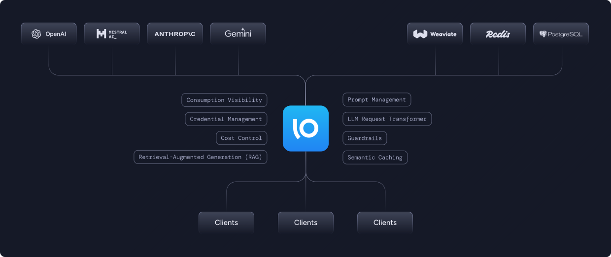
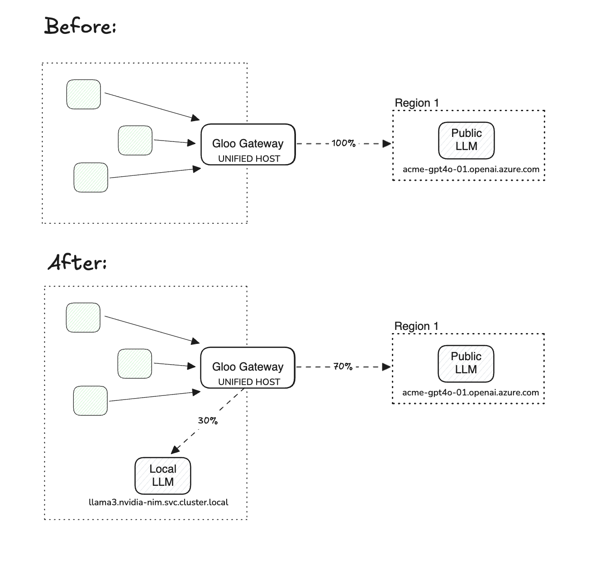
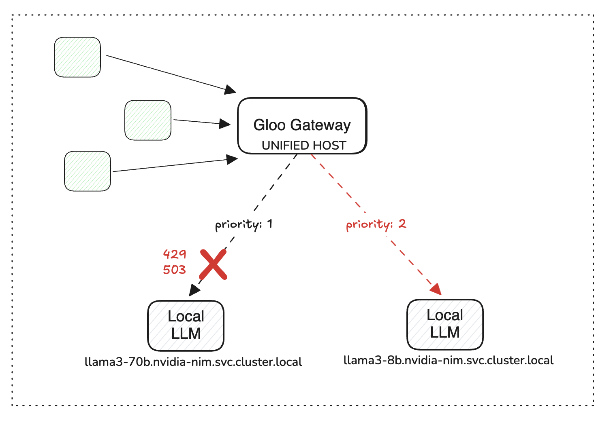
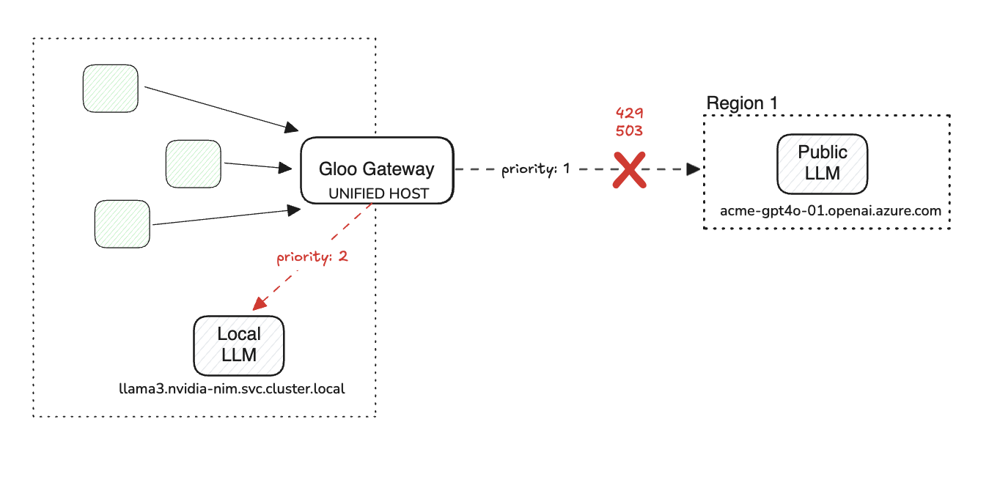
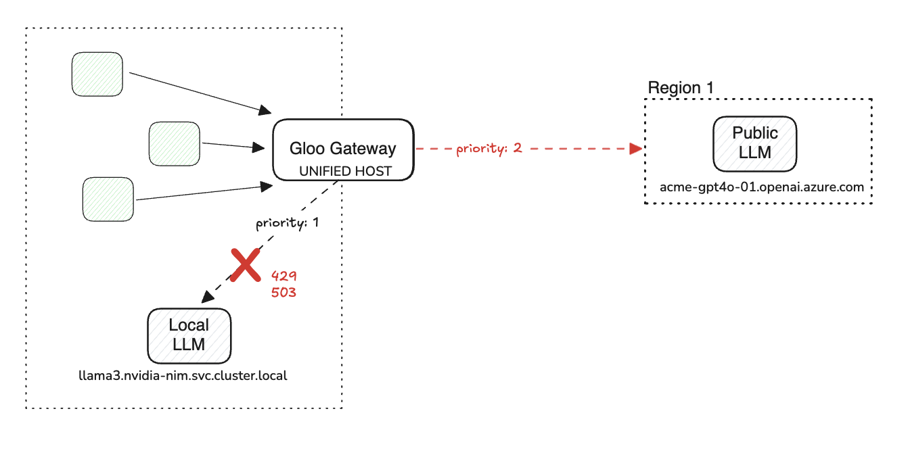

# Gloo AI Gateway Load Balancing and Failover Demo



### Setup the Environment

Add repo
```bash
helm repo add gloo-ee-test https://storage.googleapis.com/gloo-ee-test-helm
helm repo update
```

Install gateway api crds
```bash
kubectl apply -f https://github.com/kubernetes-sigs/gateway-api/releases/download/v1.0.0/standard-install.yaml
```

Install gloo gateway
```bash
helm upgrade --install -n gloo-system \
gloo-ee-test gloo-ee-test/gloo-ee \
--create-namespace \
--version 1.18.0-beta2-beitanyaai-passthrough-token-006f8e6 \
--set-string license_key=$GLOO_LICENSE_KEY \
-f -<<EOF
gloo:
  kubeGateway:
    enabled: true
  gatewayProxies:
    gatewayProxy:
      disabled: true
  discovery:
    enabled: false
gloo-fed:
  enabled: false
  glooFedApiserver:
    enable: false
# disable everything else for a simple deployment
observability:
  enabled: false
prometheus:
  enabled: false
grafana:
  defaultInstallationEnabled: false
gateway-portal-web-server:
  enabled: false
EOF
```

Install ai gateway
```bash
kubectl apply -f aig-base.yaml
```

check to see that ai gateway proxy has been created
```bash
kubectl get pods -n gloo-system | grep gloo-proxy-ai-gateway
```

Install ollama deployment which will load qwen 0.5b and 1.8b models
```bash
kubectl apply -f ollama-deploy
```

## Traffic Shifting Use Cases


Fixed Capacity Consumption
- Dynamically shift traffic to available backends without disrupting the application
- Provide a stable hostname for application owners to consume

Ephemeral Capacity Consumption
- Enable organizations to dynamically provision LLM capacity on an as-needed basis
- Dynamically shift traffic to available backends without disrupting the application
- Provide a stable hostname for application owners to consume




Leverage correct model per service
- Allow users to route traffic to local, optimized LLMs when cost optimization is a key concern
- Reduce dependency on public LLM services


### Setup the Demo

Configure qwen ai gateway 50-50 weighted traffic shift example
```bash
kubectl apply -f traffic-shift
```

Get ai gateway LB address
```bash
kubectl get svc -n gloo-system | grep gloo-proxy-ai-gateway
```

Curl ai gateway endpoint for qwen model served by ollama (note no model defined)
```bash
curl http://192.168.107.2:8080/qwen   -H "Content-Type: application/json" -d '{
    "messages": [
      {
        "role": "system",
        "content": "You are a solutions architect for kubernetes networking, skilled in explaining complex technical concepts surrounding API Gateway, Service Mesh, and CNI"
      },
      {
        "role": "user",
        "content": "Write me a 20 word pitch on why I should use a service mesh in my kubernetes cluster"
      }
    ]
  }'
```

Responses should come from `qwen-0.5b` and `qwen-1.8b` models at a 50/50 distribution

```bash
{"id": "chatcmpl-336", "object": "chat.completion", "created": 1730758794, "model": "qwen:1.8b", "system_fingerprint": "fp_ollama", "choices": [{"index": 0, "message": {"role": "assistant", "content": "By using our service mesh, you can enable seamless communication among services within your Kubernetes cluster. This allows for improved efficiency by automating routing logic and error handling across different endpoints within your cluster."}, "finish_reason": "stop"}], "usage": {"prompt_tokens": 59, "completion_tokens": 39, "total_tokens": 98}}
```

```bash
{"id": "chatcmpl-808", "object": "chat.completion", "created": 1730758807, "model": "qwen:0.5b", "system_fingerprint": "fp_ollama", "choices": [{"index": 0, "message": {"role": "assistant", "content": "Use service mesh to orchestrate networking between multiple applications.\u63d0\u9ad8\u4e86 application security and availability. Sign up and start with service mesh."}, "finish_reason": "stop"}], "usage": {"prompt_tokens": 59, "completion_tokens": 26, "total_tokens": 85}}
```

## Failover Use Cases



Local to Local Failover
- Prioritize traffic to higher quality models with failover to lower available models
- Enhance resiliency and ensure end-user outcomes



Public to Local Failover
- Prioritize traffic to public LLM with failover to local LLM
- Enhance resiliency and ensure end-user outcomes



Local to Public Failover
- Prioritize traffic to local LLM with failover to public LLM
- Reduced cost while enhancing resiliency

### Setup the Demo

Lets configure an ai gateway failover example using our qwen models

Take a look at the example `multi` upstream which enables us to do failover
```bash
cat failover/local-to-local/failover-upstream.yaml
```

Note that in the `RouteOption` we also configure retries
```bash
cat failover/local-to-local/failover-route.yaml
```

Now apply the configuration
```bash
kubectl apply -f failover/local-to-local
```

Curl ai gateway /failover endpoint
```bash
curl http://192.168.107.2:8080/failover   -H "Content-Type: application/json" -d '{
    "messages": [
      {
        "role": "system",
        "content": "You are a solutions architect for kubernetes networking, skilled in explaining complex technical concepts surrounding API Gateway, Service Mesh, and CNI"
      },
      {
        "role": "user",
        "content": "Write me a 20 word pitch on why I should use a service mesh in my kubernetes cluster"
      }
    ]
  }'
```

Responses should always come from `qwen-1.8b` if the endpoint is healthy

```bash
{"id": "chatcmpl-939", "object": "chat.completion", "created": 1730845886, "model": "qwen:1.8b", "system_fingerprint": "fp_ollama", "choices": [{"index": 0, "message": {"role": "assistant", "content": "By using a Service Mesh like OpenShift Application Default Services (ADFS) or Istio, you can decouple your applications from the underlying infrastructure. This enables easy scaling and improved fault tolerance. By adopting a Service Mesh, you will be able to build highly available and fault-tolerant kubernetes clusters that leverage the power of open source technologies."}, "finish_reason": "stop"}], "usage": {"prompt_tokens": 59, "completion_tokens": 71, "total_tokens": 130}}
```

To simulate an error we can configure the highest priority upstream to have an invalid host `host: invalidhost.foo.bar` or simulate a 429 using the `httpbin.org/status/429` endpoint
```bash
cat failover/local-to-local/simulate-error/failover-upstream.yaml
```

Now apply the configuration
```bash
kubectl apply -f failover/local-to-local/simulate-error
```

Curl ai gateway /failover endpoint
```bash
curl http://192.168.107.2:8080/failover   -H "Content-Type: application/json" -d '{
    "messages": [
      {
        "role": "system",
        "content": "You are a solutions architect for kubernetes networking, skilled in explaining complex technical concepts surrounding API Gateway, Service Mesh, and CNI"
      },
      {
        "role": "user",
        "content": "Write me a 20 word pitch on why I should use a service mesh in my kubernetes cluster"
      }
    ]
  }'
```

Responses should now failover to `qwen-0.5b` since the `qwen-1.8b` upstream is unhealthy

```bash
{"id": "chatcmpl-693", "object": "chat.completion", "created": 1730846055, "model": "qwen:0.5b", "system_fingerprint": "fp_ollama", "choices": [{"index": 0, "message": {"role": "assistant", "content": "A service mesh provides a centralized solution for managing network traffic. This saves time, bandwidth, and complexity that are typical of managed networks alone. Therefore, using a service mesh is an excellent decision for managing network traffic in your kubernetes cluster."}, "finish_reason": "stop"}], "usage": {"prompt_tokens": 59, "completion_tokens": 50, "total_tokens": 109}}
```

Simulate openai to local failover

Create a kubernetes secret containing your openai API key
```bash
kubectl create secret generic openai-secret -n gloo-system \
--from-literal="Authorization=Bearer $OPENAI_API_KEY" \
--dry-run=client -oyaml | kubectl apply -f -
```

Take a look at the example `multi` upstream which enables us to do failover from openai to our local qwen-0.5b model
```bash
cat failover/openai-to-local/openai-to-local-upstream.yaml
```

Now apply the configuration
```bash
kubectl apply -f failover/openai-to-local
```

curl ai gateway /openai endpoint
```bash
curl http://192.168.107.2:8080/openai   -H "Content-Type: application/json" -d '{
    "messages": [
      {
        "role": "system",
        "content": "You are a solutions architect for kubernetes networking, skilled in explaining complex technical concepts surrounding API Gateway, Service Mesh, and CNI"
      },
      {
        "role": "user",
        "content": "Write me a 20 word pitch on why I should use a service mesh in my kubernetes cluster"
      }
    ]
  }'
```

Responses should always come from openai `gpt-4o-mini` if the endpoint is healthy

```bash
{"id": "chatcmpl-AQO5yy1aeBygiC6LRxGfg4gReexQw", "object": "chat.completion", "created": 1730852514, "model": "gpt-4o-mini-2024-07-18", "choices": [{"index": 0, "message": {"role": "assistant", "content": "A service mesh enhances your Kubernetes cluster by providing traffic control, observability, security, and reliability, simplifying microservices communication management.", "refusal": null}, "logprobs": null, "finish_reason": "stop"}], "usage": {"prompt_tokens": 59, "completion_tokens": 26, "total_tokens": 85, "prompt_tokens_details": {"cached_tokens": 0}, "completion_tokens_details": {"reasoning_tokens": 0, "accepted_prediction_tokens": 0, "rejected_prediction_tokens": 0}}, "system_fingerprint": "fp_0ba0d124f1"}
```

To simulate an error we can configure the highest priority upstream to have an invalid host `host: invalidhost.foo.bar` or simulate a 429 using the `httpbin.org/status/429` endpoint
```bash
cat failover/openai-to-local/simulate-error/openai-to-local-upstream.yaml
```

Now apply the configuration
```bash
kubectl apply -f failover/openai-to-local/simulate-error/
```

curl ai gateway /openai endpoint
```bash
curl http://192.168.107.2:8080/openai   -H "Content-Type: application/json" -d '{
    "messages": [
      {
        "role": "system",
        "content": "You are a solutions architect for kubernetes networking, skilled in explaining complex technical concepts surrounding API Gateway, Service Mesh, and CNI"
      },
      {
        "role": "user",
        "content": "Write me a 20 word pitch on why I should use a service mesh in my kubernetes cluster"
      }
    ]
  }'
```

Responses should now failover to `qwen-0.5b` since the `openai` upstream is unhealthy
```bash
{"id": "chatcmpl-693", "object": "chat.completion", "created": 1730846055, "model": "qwen:0.5b", "system_fingerprint": "fp_ollama", "choices": [{"index": 0, "message": {"role": "assistant", "content": "A service mesh provides a centralized solution for managing network traffic. This saves time, bandwidth, and complexity that are typical of managed networks alone. Therefore, using a service mesh is an excellent decision for managing network traffic in your kubernetes cluster."}, "finish_reason": "stop"}], "usage": {"prompt_tokens": 59, "completion_tokens": 50, "total_tokens": 109}}
```

## Cleanup

Remove routes
```bash
kubectl delete -f failover/openai-to-local
kubectl delete -f failover/local-to-local
kubectl delete -f traffic-shift
```

Delete ollama deployment
```bash
kubectl delete -f ollama-deploy
```

Delete AI Gateway
```bash
kubectl delete -f aig-base.yaml
```

Uninstall Gloo
```bash
helm uninstall gloo-ee-test -n gloo-system
```

## AI gateway failover metrics (WIP)

Port forward to 19000 of the ai gateway pod
```bash
kubectl port-forward -n gloo-system $(kubectl get pod -l gateway.networking.k8s.io/gateway-name=ai-gateway -n gloo-system -o jsonpath='{.items[0].metadata.name}') 19000:19000
```

